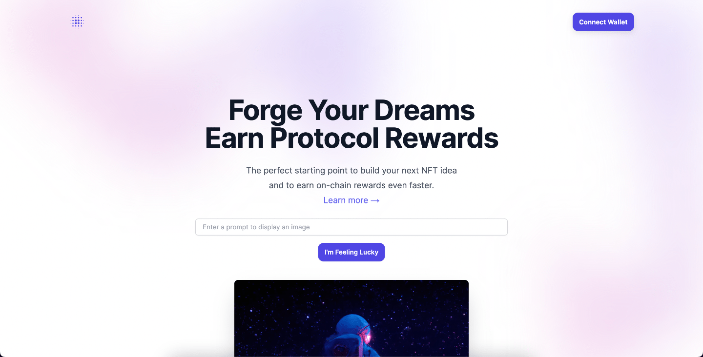

# GenNFT Forge

---

GenNFT Forge is the perfect starting point to build your next NFT idea
and to earn on-chain rewards even faster.

GenNFT Forge is a web application that allows you to enter prompts into a generative AI, and then create smart contracts for the end user, which they can then mint.

## How it works:

1.  Connect your wallet
2.  Enter a prompt
3.  Click to call the contract

### 1.

In order to get started the user must connect a wallet. This is done via RainbowKit, a React library that allows you to easily add wallet connection to your dapp.

### 2.

Once your wallet is connected, you can then enter any prompt to StableDiffusion (a text-to-image diffusion model capable of generating photo-realistic images given any text input) via its API.

### 3.

The application then calls the Zora NFT Creator Proxy with some dynamic and static data including the image url , which then contract for the end user to manage in a minting page.

---

This Project was made specifically for the Future of Blockchain University Hackathon by Encode Club.

It was planned, developed, and tested by the following team members of the SummerEncoders team:

https://github.com/ivanmolto

https://github.com/sina206

https://github.com/matangolani

---

### Benefits:

- Only ENS names are whitelisted.

Whitelisting ENS names on a web app for minting NFTs can significantly enhance the security and trustworthiness of the platform. ENS names are Ethereum domain names that map to blockchain addresses. By whitelisting ENS names, the platform can ensure that only verified and legitimate users are able to mint NFTs. This prevents unauthorized access and reduces the likelihood of fraudulent activities.

- Creative Expression

The app empowers users to express their creativity by providing them with a tool to generate unique images based on their prompts. Users can experiment with various inputs to produce diverse and imaginative artworks.

- Zora Protocol Rewards .

With Zora Protocol Rewards, users enjoy a seamless and transparent onchain earning experience, ensuring security and trust through direct blockchain interactions. This empowers participants with ownership and control over their rewards, fostering a decentralized and user-centric ecosystem.

## Working Demo

<video src="demo.mp4" width="320" height="240" controls></video>

## Step by step guide:

### 1. Connect Wallet



### 2. Enter Prompt


### 3. Press "I'm Feeling Lucky" Button


### 4. "Press Create NFT" Button


### 5. Confirm Transaction Fees


### 6. Manage images on minting page


## Set Up

This is a [Next.js](https://nextjs.org/) project bootstrapped with [`create-next-app`](https://github.com/vercel/next.js/tree/canary/packages/create-next-app).

## Getting Started

First, run the development server:

```bash
npm run dev
# or
yarn dev
# or
pnpm dev
```

Open [http://localhost:3000](http://localhost:3000) with your browser to see the result.

You can start editing the page by modifying `pages/index.tsx`. The page auto-updates as you edit the file.

[API routes](https://nextjs.org/docs/api-routes/introduction) can be accessed on [http://localhost:3000/api/hello](http://localhost:3000/api/hello). This endpoint can be edited in `pages/api/hello.ts`.

The `pages/api` directory is mapped to `/api/*`. Files in this directory are treated as [API routes](https://nextjs.org/docs/api-routes/introduction) instead of React pages.

This project uses [`next/font`](https://nextjs.org/docs/basic-features/font-optimization) to automatically optimize and load Inter, a custom Google Font.

## Learn More

To learn more about Next.js, take a look at the following resources:

- [Next.js Documentation](https://nextjs.org/docs) - learn about Next.js features and API.
- [Learn Next.js](https://nextjs.org/learn) - an interactive Next.js tutorial.

You can check out [the Next.js GitHub repository](https://github.com/vercel/next.js/) - your feedback and contributions are welcome!

## Deploy on Vercel

The easiest way to deploy your Next.js app is to use the [Vercel Platform](https://vercel.com/new?utm_medium=default-template&filter=next.js&utm_source=create-next-app&utm_campaign=create-next-app-readme) from the creators of Next.js.

Check out our [Next.js deployment documentation](https://nextjs.org/docs/deployment) for more details.
